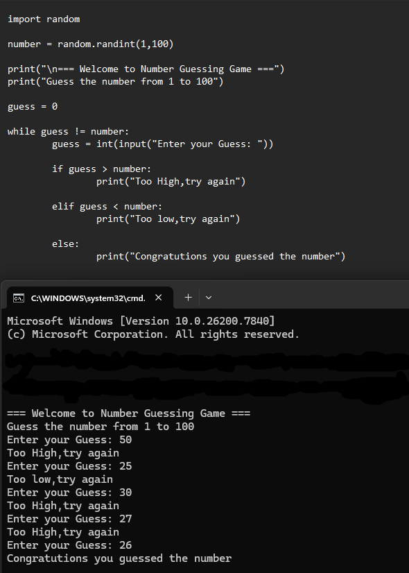

# 🎯 Guess the Number Game — Python

This is a command-line number guessing game built using Python.

The system generates a random number between 1 and 100, and the user attempts to guess it with hint feedback.

## Features
- Random number generation
- High/Low hints
- Loop-based gameplay
- User input handling

## CODE & OUTPUT


## How to Run

```bash
python guess_number_game.py
